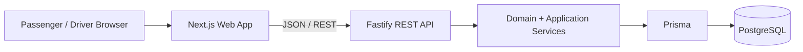

# Dhaka Tesla Pool

> **Share a seat. Split the fare. Survive Dhaka traffic.**

Dhaka Tesla Pool is a full-stack ride-pooling application built around a simple Dhaka story: Jashim drives a three-seat Tesla named **Bullet**, while passengers such as Nusrat, Rafiq, and Shirin request compatible rides and share the available capacity.

The project focuses on the engineering problems behind pooling rather than map complexity: authentication, authorization, deterministic matching, individual fare calculation, lifecycle management, strict capacity enforcement, concurrent seat claims, reproducible Docker setup, and automated testing.

## Demo Story

The seeded scenario includes:

| Person | Role      | Example route                              |
| ------ | --------- | ------------------------------------------ |
| Jashim | Driver    | Drives **Bullet**                          |
| Nusrat | Passenger | Banani → Mohakhali                         |
| Rafiq  | Passenger | Banani → Gulshan 1                         |
| Shirin | Passenger | Competes for the remaining compatible seat |

**Bullet has a fixed capacity of 3 seats.**

A typical demo flow is:

1. Jashim signs in and takes Bullet online.
2. Nusrat requests Banani → Mohakhali.
3. Jashim accepts Nusrat's request.
4. Rafiq requests Banani → Gulshan 1 and is automatically matched into the compatible accepted pool.
5. Shirin requests another compatible ride and can occupy the final seat.
6. Jashim marks arrival, starts the ride, and completes it.
7. Each passenger sees only their own fare and ride information.

The concurrency tests also cover the harder case where two passengers attempt to claim the final available seat at the same time.

## Features

### Passenger

- Email/password authentication
- Request a supported Dhaka route
- Select seat count
- Server-calculated estimated fare
- Automatic compatible pool matching
- View current ride and lifecycle status
- Cancel during valid cancellable states
- View completed/cancelled ride history
- See only the passenger's own fare and private ride information

### Driver

- Authenticated driver access
- Take Bullet online or offline
- View relevant unassigned requests
- Accept an initial passenger request
- View active pooled passengers and occupied seats
- Mark driver arrival
- Start and complete a ride
- View completed ride history
- Driver responses deliberately exclude passenger fare data

### Pooling and Safety

- Multiple compatible passengers can share one Tesla
- Fixed vehicle capacity is enforced by the backend
- Pool matching uses deterministic predefined Dhaka corridors
- Accepted pools can receive later compatible passengers while still open
- Individual passenger fares are preserved
- Lifecycle transitions are validated
- Capacity-sensitive matching uses PostgreSQL transactions and row locks
- Concurrent final-seat claims cannot overbook Bullet

## Architecture

Dhaka Tesla Pool is a **modular monolith** with separate web and API applications in one npm workspace.



The browser is not authoritative for fares, capacity, matching, authorization, or lifecycle transitions. Those rules are enforced by the API and database-backed services.

More detail:

- [`docs/architecture/system-design.md`](docs/architecture/system-design.md)
- [`docs/architecture/decisions.md`](docs/architecture/decisions.md)

## Tech Stack

| Layer              | Technology                                     |
| ------------------ | ---------------------------------------------- |
| Frontend           | Next.js 16, React 19, TypeScript, Tailwind CSS |
| Backend            | Node.js 24+, Fastify 5, TypeScript             |
| Validation         | Zod 4                                          |
| Authentication     | JWT + bcrypt password hashing                  |
| Database           | PostgreSQL 17                                  |
| ORM                | Prisma 7                                       |
| Testing            | Vitest 5                                       |
| Containerization   | Docker + Docker Compose                        |
| Package management | npm workspaces                                 |

## Project Structure

```text
dhaka-tesla-pool/
├── apps/
│   ├── api/
│   │   ├── prisma/
│   │   │   ├── migrations/
│   │   │   ├── schema.prisma
│   │   │   └── seed.ts
│   │   └── src/
│   │       ├── auth/
│   │       ├── db/
│   │       ├── domain/
│   │       ├── plugins/
│   │       ├── routes/
│   │       └── services/
│   └── web/
│       └── src/
│           ├── app/
│           ├── components/
│           └── lib/
├── docs/
│   └── architecture/
├── compose.yaml
├── package.json
└── README.md
```

## Quick Start with Docker

### Prerequisites

Install:

- Docker Desktop or Docker Engine with Docker Compose
- Git

Node.js is not required on the host when running the complete application through Docker.

### 1. Clone the repository

```bash
git clone https://github.com/sajedur-me/dhaka-tesla-pool.git
cd dhaka-tesla-pool
```

### 2. Create the root environment file

```bash
cp .env.example .env
```

The provided defaults are suitable for local Docker development. Change `JWT_SECRET` before using the application outside a local development environment.

### 3. Start the stack

```bash
docker compose up --build
```

Docker Compose will:

1. Start PostgreSQL.
2. Wait for the database health check.
3. Run Prisma migrations.
4. Seed the deterministic Jashim/Nusrat/Rafiq/Shirin story data.
5. Start the Fastify API.
6. Wait for the API health check.
7. Start the Next.js web application.

Open:

- Web: `http://localhost:3000`
- API health: `http://localhost:3001/health`

To stop the stack:

```bash
docker compose down
```

The PostgreSQL named volume is preserved by the normal `docker compose down` command.

## Demo Accounts

The story seed creates these accounts:

| User   | Role      | Email                    | Password        |
| ------ | --------- | ------------------------ | --------------- |
| Jashim | Driver    | `jashim@dhakapool.local` | `DhakaPool123!` |
| Nusrat | Passenger | `nusrat@dhakapool.local` | `DhakaPool123!` |
| Rafiq  | Passenger | `rafiq@dhakapool.local`  | `DhakaPool123!` |
| Shirin | Passenger | `shirin@dhakapool.local` | `DhakaPool123!` |

The seed also creates **Bullet**, assigns it to Jashim, fixes its capacity at **3**, and initially keeps it offline.

These credentials are intentionally deterministic demo credentials and must not be treated as production secrets.

## Local Development without Full Docker

The project requires Node.js 24+.

Install dependencies:

```bash
npm ci
```

A PostgreSQL instance must be available.

Create the API environment file:

```bash
cp apps/api/.env.example apps/api/.env
```

Apply migrations and seed the database:

```bash
cd apps/api
npx prisma migrate deploy
npx prisma db seed
cd ../..
```

Run the API:

```bash
npm run dev:api
```

Run the web application in another terminal:

```bash
npm run dev:web
```

## Supported Dhaka Routes

The MVP intentionally uses predefined zones and deterministic distances instead of a commercial maps API.

Supported directed routes include:

| Route                 | Distance |
| --------------------- | -------: |
| Banani → Mohakhali    |     3 km |
| Banani → Gulshan 1    |     4 km |
| Banani → Gulshan 2    |     5 km |
| Mohakhali → Gulshan 1 |     2 km |
| Mohakhali → Gulshan 2 |     3 km |
| Gulshan 1 → Gulshan 2 |     2 km |
| Mirpur → Farmgate     |     7 km |
| Mirpur → Dhanmondi    |    10 km |
| Farmgate → Dhanmondi  |     4 km |
| Uttara → Banani       |    10 km |
| Uttara → Bashundhara  |    12 km |
| Banani → Bashundhara  |     5 km |

This keeps matching and fare behavior deterministic and easy to test.

## Pooling Rules

A new passenger request can join an existing open pool when:

1. The pool has an assigned vehicle.
2. The vehicle is online.
3. The ride is still open for matching: `REQUESTED`, `MATCHED`, or `ACCEPTED`.
4. The new request is route-compatible with the pool.
5. The requested seats fit within the vehicle's remaining capacity.

Compatibility is based on predefined Dhaka corridors and downstream destinations rather than real-time routing.

When a passenger joins an already `ACCEPTED` pool, the pool remains `ACCEPTED`; its lifecycle is not moved backwards.

## Ride Lifecycle

The primary lifecycle is:

```text
REQUESTED
   ↓
MATCHED
   ↓
ACCEPTED
   ↓
DRIVER_ARRIVED
   ↓
STARTED
   ↓
COMPLETED
```

Cancellation is allowed only from supported pre-completion states.

`COMPLETED` and `CANCELLED` are terminal states.

The backend owns lifecycle transitions. UI state cannot directly force an invalid transition.

## Fare Model

All money is stored as **integer poisha**, avoiding floating-point currency errors.

The deterministic MVP fare model is:

```text
base fare       = 5,000 poisha
per-km rate     = 2,000 poisha
pool discount   = 20%
```

Conceptually:

```text
unpooled fare = base fare + (distance × per-km rate)
pooled fare   = unpooled fare × 80%
```

Example:

```text
Banani → Mohakhali
distance = 3 km

5,000 + (3 × 2,000) = 11,000 poisha
20% pool discount   = 8,800 poisha
                         = BDT 88
```

Each `RidePassenger` stores its own `farePoisha`, so passengers in the same pool can retain different fares.

## Capacity and Concurrency

Capacity is a server-side invariant. Client-side seat availability is only informational.

Matching is performed inside a PostgreSQL transaction.

For a capacity-sensitive match, the service:

1. Locks the standalone request ride with `SELECT ... FOR UPDATE`.
2. Finds a compatible open pool.
3. Locks the candidate pooled ride.
4. Locks its vehicle.
5. Recalculates occupied seats after acquiring the locks.
6. Rejects the match if the new seat count would exceed vehicle capacity.
7. Moves the passenger membership into the pool atomically.

This lock-and-recheck approach protects the final seat from concurrent claims.

The automated suite includes both lower-level matching races and a production-path test in which two simultaneous `createRideRequest()` calls compete for Bullet's final available seat. Exactly one contender joins the pool; the other remains a valid standalone `REQUESTED` ride.

The backend also prevents the same driver from accepting multiple independent active rides, including concurrent accept attempts.

## API Overview

### Public

| Method | Endpoint         | Purpose                        |
| ------ | ---------------- | ------------------------------ |
| `GET`  | `/health`        | API health check               |
| `POST` | `/auth/register` | Register an account            |
| `POST` | `/auth/login`    | Authenticate and receive a JWT |

### Passenger

Authenticated passenger operations include:

- Create a ride request
- List own rides/history
- Read an own ride
- Cancel an eligible own ride

### Driver

Authenticated driver operations include:

- Read vehicle state
- Toggle vehicle online/offline
- View available ride requests
- Accept a request
- Read active pooled ride
- Read completed history
- Mark arrival
- Start ride
- Complete ride

Authorization is enforced by the API, not by navigation visibility alone.

## Testing

Run the complete workspace test suite:

```bash
npm test
```

Run API tests only:

```bash
npm test --workspace=@dhaka-tesla-pool/api
```

At the current assessment milestone, the API suite contains:

```text
25 test files
185 tests
```

The suite covers authentication, authorization, fare calculations, routes, pooling compatibility, capacity, lifecycle transitions, cancellation, driver operations, privacy boundaries, story integration, and concurrency races.

Additional static checks:

```bash
npm run typecheck
npm run lint
```

## Data Model

The persistence model intentionally uses four primary entities:

- `User` — passenger or driver identity
- `Vehicle` — the driver's Tesla, capacity, and operational state
- `Ride` — a standalone request or shared ride/pool
- `RidePassenger` — passenger-specific membership, route, seats, fare, and status

A standalone passenger request initially owns its own `Ride` and `RidePassenger` membership.

When it matches an existing pool, the membership is moved atomically to the existing `Ride`, and the now-empty standalone request ride is removed.

This lets one model represent both standalone requests and pooled rides while keeping passenger-specific fare and status data separate.

## Security and Privacy Notes

- Passwords are hashed with bcrypt.
- JWTs protect authenticated API routes.
- Role checks separate passenger and driver capabilities.
- Passenger queries are scoped to the authenticated passenger.
- Driver pool responses intentionally omit passenger fares.
- Input validation uses Zod at API boundaries.
- Database constraints protect core numeric integrity.

For this assessment MVP, the web client stores the JWT in `sessionStorage`. A production deployment would preferably use a hardened same-origin authentication design such as secure, `HttpOnly`, `SameSite` cookies and would add broader account security controls.

## Design Trade-offs and Limitations

This project intentionally prioritizes correctness and reproducibility over production-scale scope.

- **Predefined routes:** no live maps, traffic, geocoding, or ETA service.
- **Focused story:** the product experience centers on Jashim and Bullet.
- **Automatic pool joining:** later compatible requests can join an open accepted pool while capacity remains.
- **Modular monolith:** microservices were intentionally avoided for this MVP.
- **Authentication scope:** MFA, password recovery, email verification, rate limiting, and refresh-token infrastructure are outside the assessment scope.
- **Deterministic fares:** the pricing model demonstrates correct money handling rather than reproducing a commercial ride-hailing tariff.

## Git Workflow

Development uses short-lived `feature/*` branches with logical commits.

The assessment release workflow uses:

```text
master
pre-release
release/v1.0.0
```

Commit messages follow:

```text
<type>(<scope>): <short description>
```

Examples:

```text
feat(driver): add pooled ride management
fix(rides): prevent multiple active driver rides
test(pooling): cover production concurrency
```

## AI Usage

AI-assisted development was used during this assessment.

AI was used as a development aid for activities including:

- discussing architecture and implementation approaches
- reviewing business-rule edge cases
- drafting and refining implementation code
- debugging TypeScript, Docker, CORS, test, and integration issues
- designing concurrency and regression test scenarios
- reviewing UI/UX implementation
- helping prepare technical documentation

The implementation was developed incrementally and validated through local execution, database migrations, browser-level story testing, type checking, linting, automated tests, Git diffs, and explicit concurrency tests.

AI output was treated as implementation assistance rather than as a substitute for verification. Project-specific decisions, integration behavior, and final repository state were checked against the running application and automated test suite.

## Assessment Highlights

1. **Pooling model:** standalone requests and shared rides use one consistent relational model.
2. **Concurrency safety:** final-seat allocation uses transactional row locking and post-lock capacity revalidation.
3. **Lifecycle integrity:** ride state changes are explicit and tested.
4. **Privacy boundary:** passenger fares remain passenger-specific and are excluded from driver pool responses.
5. **Reproducibility:** Docker Compose handles database startup, migrations, deterministic story seeding, API health checking, and web startup.
6. **Testing:** automated coverage includes domain rules, API authorization, integration behavior, and real concurrency races.

---

**Dhaka Tesla Pool**
_Share a seat. Split the fare. Survive Dhaka traffic._
