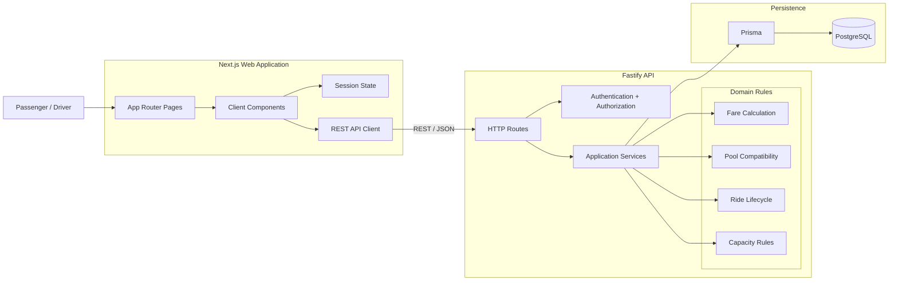
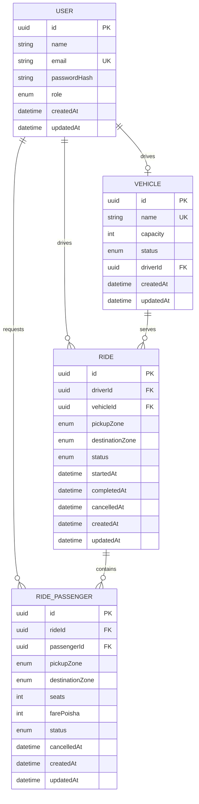
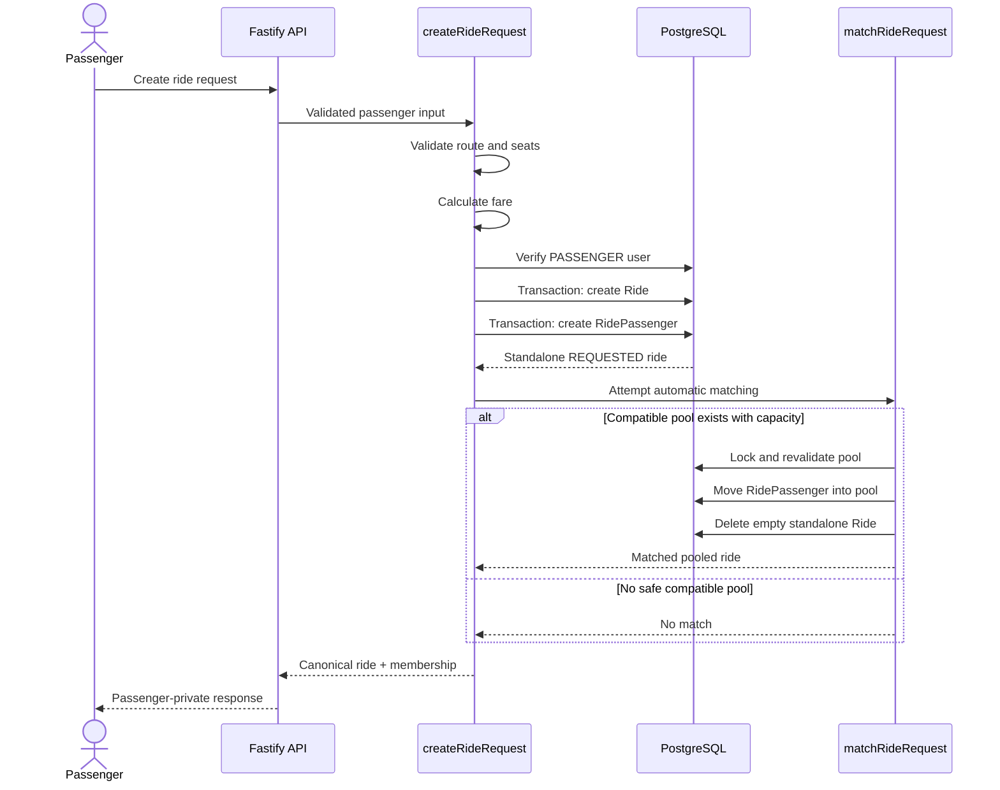
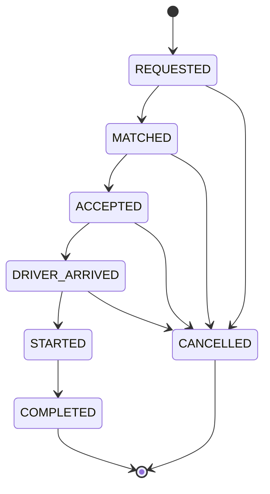
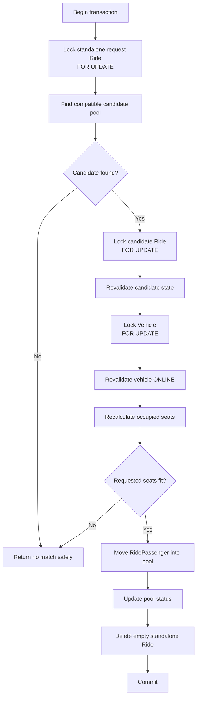
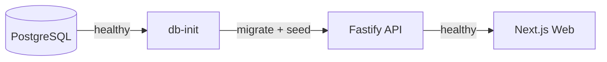

# System Design

This document describes the implemented architecture, data model, responsibility boundaries, pooling flow, and consistency strategy of Dhaka Tesla Pool.

## 1. System Architecture

Dhaka Tesla Pool is a modular monolith with separate web and API applications backed by PostgreSQL.



The API is the authoritative boundary for business rules. The web application presents state and submits commands, but it does not decide whether a ride can be pooled, whether a lifecycle transition is valid, what fare should be stored, or whether a seat is still available.

## 2. Repository Architecture

The project uses npm workspaces:

```text
dhaka-tesla-pool/
├── apps/
│   ├── api/
│   │   ├── prisma/
│   │   └── src/
│   │       ├── auth/
│   │       ├── db/
│   │       ├── domain/
│   │       ├── plugins/
│   │       ├── routes/
│   │       └── services/
│   └── web/
│       └── src/
│           ├── app/
│           ├── components/
│           └── lib/
├── docs/
│   └── architecture/
├── compose.yaml
└── package.json
```

The backend remains one deployable API rather than being split into microservices. Business concerns are separated in code while sharing one transactional database boundary.

## 3. Responsibility Boundaries

### Next.js Web

The web application is responsible for:

- passenger and driver interfaces
- navigation
- form input
- loading and error states
- storing the assessment JWT session in the browser
- displaying API-provided ride information
- presenting available user actions

The web client is not authoritative for domain invariants.

### Fastify API

The API is responsible for:

- authentication
- role authorization
- request validation
- passenger ride creation
- driver operations
- server-side fare calculation
- pooling
- cancellation
- lifecycle transitions
- private-data boundaries
- coordinating transactional persistence

### Domain Layer

Pure or deterministic business rules are kept outside the HTTP layer where practical.

Examples include:

- fare calculation
- route-distance lookup
- pooling compatibility
- seat-capacity checks
- lifecycle transition validation

This keeps important rules directly testable without requiring a browser.

### PostgreSQL

PostgreSQL is the final consistency boundary.

It provides:

- durable relational storage
- transactions
- row-level locking
- database constraints
- atomic capacity-sensitive operations

Client-side seat counts are never treated as authoritative.

## 4. Implemented Data Model

The implemented persistence model uses four primary entities:

- `User`
- `Vehicle`
- `Ride`
- `RidePassenger`



`Ride.driverId` and `Ride.vehicleId` are nullable because a newly created passenger request begins unassigned.

## 5. Why `Ride` Represents Both a Request and a Pool

The persistence model deliberately avoids separate `RideRequest` and `RidePool` tables.

A new passenger request initially creates:

```text
Ride
└── RidePassenger
```

The `Ride` begins as `REQUESTED`, with no driver or vehicle assigned.

If it remains unmatched, that pair continues to represent the passenger's standalone request.

If it joins an existing compatible pool, its `RidePassenger` membership is moved to the existing pooled `Ride` and the now-empty standalone `Ride` is deleted.

The resulting pool can therefore look like:

```text
Ride
├── RidePassenger: Nusrat
├── RidePassenger: Rafiq
└── RidePassenger: Shirin
```

This design keeps shared lifecycle and vehicle assignment on `Ride` while keeping passenger-specific route, seat count, fare, and status on `RidePassenger`.

## 6. Passenger Ride Creation Flow

A passenger request follows this sequence:



Fare calculation happens on the server before persistence. The client does not submit an authoritative fare.

## 7. Pool Compatibility

The MVP uses predefined Dhaka corridors rather than real-time map routing.

Compatibility requires:

1. a compatible pickup
2. destinations that are downstream within a supported corridor
3. an existing pool that is open for matching
4. an online assigned vehicle
5. enough remaining vehicle capacity

Open pool states are:

```text
REQUESTED
MATCHED
ACCEPTED
```

A passenger joining an `ACCEPTED` pool receives `ACCEPTED` membership status and the parent ride remains `ACCEPTED`.

This prevents a later match from moving an already accepted ride backwards in its lifecycle.

## 8. Fare Model

Route distance is selected from a predefined directed distance table.

The fare model is:

```text
BASE_FARE_POISHA        = 5,000
PER_KM_RATE_POISHA      = 2,000
POOL_DISCOUNT_PERCENT   = 20
```

The conceptual calculation is:

```text
unpooled fare = base + (distance × per-km rate)
pooled fare   = unpooled fare × 80%
```

Money is stored as integer poisha rather than floating-point BDT values.

Each `RidePassenger` owns its own `farePoisha`, allowing passengers in the same Tesla to have different route-based fares.

## 9. Ride Lifecycle

The main lifecycle is:



Invalid transitions are rejected by backend domain logic.

The driver advances the shared ride through:

```text
ACCEPTED
→ DRIVER_ARRIVED
→ STARTED
→ COMPLETED
```

When the ride starts, the assigned vehicle moves to `ON_RIDE`.

When the ride completes, the vehicle returns to `ONLINE`.

## 10. Capacity Invariant

The central capacity invariant is:

```text
sum(active passenger seats) <= vehicle.capacity
```

For Bullet:

```text
vehicle.capacity = 3
```

Active passenger statuses used by matching include:

```text
REQUESTED
MATCHED
ACCEPTED
DRIVER_ARRIVED
STARTED
```

A browser displaying “1 seat left” does not reserve that seat. Capacity is decided only inside the backend transaction.

## 11. Concurrency Strategy

The important race condition is:

```text
Bullet capacity:       3
Already occupied:      2
Seats remaining:       1

Shirin:                 requests 1 seat
Another passenger:      requests 1 seat

Both requests arrive concurrently.
```

A check-then-write implementation without locking could allow both requests to observe one free seat and create a 4/3 pool.

Dhaka Tesla Pool prevents that with transactional row locking and post-lock revalidation.

### Matching lock flow



The important detail is that capacity is recalculated **after the relevant pool and vehicle rows are locked**.

Concurrent contenders therefore serialize around the protected state. Once the first transaction consumes the final seat, the next transaction rechecks the committed occupancy and cannot overbook the vehicle.

## 12. Driver Active-Ride Invariant

A second concurrency-sensitive rule prevents one driver from accepting multiple unrelated active rides.

The acceptance flow locks the driver's vehicle before checking for another active ride assigned to that vehicle.

Relevant active states are:

```text
ACCEPTED
DRIVER_ARRIVED
STARTED
```

Because concurrent accept attempts serialize on the vehicle lock, only one independent ride can become the driver's active ride.

Compatible passengers should join the existing pool instead of creating multiple simultaneously active rides for the same driver.

## 13. Privacy Boundaries

Passenger fare information is passenger-specific.

The API follows two important rules:

1. Passenger ride queries are scoped to the authenticated passenger.
2. Driver active/history pool projections do not select passenger `farePoisha`.

The UI therefore does not rely on merely hiding another passenger's fare. The driver response itself excludes that field.

## 14. Authentication and Authorization

Authentication uses:

- email/password credentials
- bcrypt password hashing
- JWT access tokens

Protected routes verify the token and enforce role-specific access.

The two principal roles are:

```text
PASSENGER
DRIVER
```

Authorization is enforced by the API even if a user manually calls an endpoint outside the intended UI.

## 15. Docker Runtime

The Docker Compose runtime is:



Startup order:

1. PostgreSQL starts.
2. PostgreSQL health check succeeds.
3. `db-init` runs Prisma migrations and story seed.
4. API starts.
5. API `/health` succeeds.
6. Web application starts.

The normal developer command is:

```bash
docker compose up --build
```

## 16. Core Invariants

The implementation is designed to preserve these rules:

1. Occupied seats never exceed vehicle capacity.
2. Seat allocation is authoritative only on the server.
3. A driver cannot own multiple independent active rides.
4. Passenger fares are calculated server-side.
5. Money is stored as integer poisha.
6. A passenger sees only their own private fare information.
7. Driver pool responses exclude passenger fares.
8. Ride lifecycle transitions follow explicitly allowed state changes.
9. Cancellation is restricted to supported states.
10. Capacity-sensitive writes are transactional.
11. Concurrent final-seat requests cannot create an over-capacity pool.
12. Matching an accepted pool does not regress its lifecycle state.

## 17. Testing Strategy

Testing is intentionally layered.

### Domain tests

Cover deterministic rules such as:

- fares
- route distances
- pooling compatibility
- capacity checks
- lifecycle transitions

### Service and integration tests

Cover database-backed behavior such as:

- ride creation
- matching
- cancellation
- driver acceptance
- lifecycle updates
- story behavior
- privacy projections

### Concurrency tests

Explicitly exercise:

- two contenders for the final pooled seat
- final-seat contention against an already accepted pool
- simultaneous production `createRideRequest()` calls
- simultaneous independent driver accept attempts

At the current assessment milestone, the API regression suite contains **25 test files and 185 passing tests**.

## 18. Scope Boundary

This is an assessment-focused MVP.

It intentionally does not implement:

- live GPS
- real-time traffic
- external mapping APIs
- route optimization
- payment processing
- dynamic commercial pricing
- push notifications
- multi-region infrastructure
- microservices

The architecture prioritizes deterministic business rules, transactional correctness, reproducibility, and clear engineering trade-offs.
