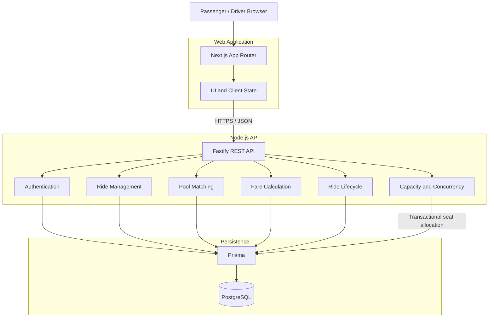
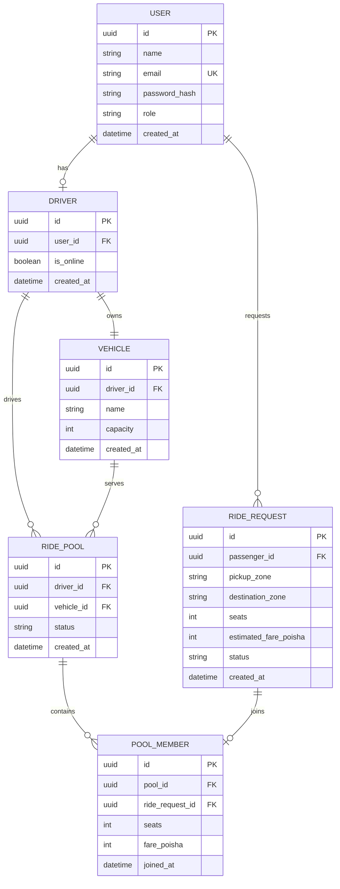

# System Design

This document describes the high-level architecture and responsibility boundaries of Dhaka Tesla Pool.

## System Architecture

Dhaka Tesla Pool uses a modular monolith with independently structured web and API applications backed by PostgreSQL.

## Responsibility Boundaries

**Next.js Web**

Responsible for passenger and driver interfaces, route navigation, form interactions, loading and error states, and presenting server-provided ride data.

**Fastify API**

Acts as the authoritative application boundary. It handles authentication, authorization, validation, ride commands, pooling decisions, fare calculation, and lifecycle transitions.

**Domain Modules**

Business rules remain on the server. The browser cannot decide whether a passenger fits in a pool, whether a state transition is valid, or whether a seat is still available.

**PostgreSQL**

Provides durable relational storage and the final consistency boundary. Capacity-sensitive operations are performed transactionally so concurrent requests cannot overbook a Tesla.## Entity Relationship Diagram

## Entity Relationship Diagram

The initial relational model separates user identity, vehicle ownership, passenger ride requests, shared pools, and pool membership.

## Core Invariants

The implementation must preserve these rules regardless of client behavior:

1. A vehicle's occupied seats must never exceed its fixed capacity.
2. A ride request cannot reserve more seats than the selected vehicle can support.
3. A passenger fare belongs to that passenger's ride request or pool membership and is not shared as another passenger's private data.
4. Ride lifecycle transitions must follow explicitly allowed state changes.
5. Cancellation is permitted only from valid cancellable states.
6. Pool membership and seat allocation must be changed atomically when capacity is contested.
7. Fare values are stored as integer poisha rather than floating-point currency values.

## Initial Matching Boundary

The MVP will use predefined Dhaka zones rather than depending on a commercial mapping API.

A request can be considered for pooling when its pickup and destination zones are compatible with the active pool's route and sufficient seat capacity remains.

The exact compatibility rule will be implemented as deterministic domain logic and covered by tests using the Nusrat, Rafiq, Shirin, Jashim, and Bullet story scenario.
